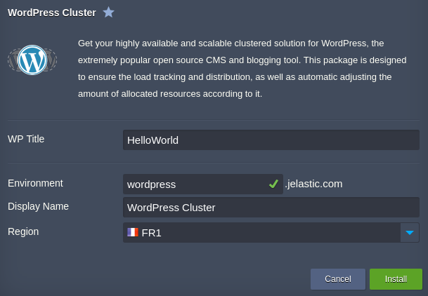

# Highly Available and Auto-Scalable WordPress Cluster

Out-of-the-box automated WordPress Cluster solution for one-click installation of the latest CMS version on the top of certified Jelastic dockerized stack templates.

## WordPress Cluster Environment Topology

Upon the package installation, a new environment with the following components will be created: 
* as an entry point, the **NGINX** load balancer is used, aimed  to distribute the incoming traffic within a cluster
* the WordPress application itself is handled by two **NGINX PHP** servers with preconfigured [automatic horizontal scaling](https://docs.jelastic.com/automatic-horizontal-scaling) to handle load spikes
* two **MySQL** DB servers with asynchronous Master-Master replication to store and operate user data
* dedicated **[Data Storage](https://docs.jelastic.com/data-storage-container)** node with WordPress-dedicated directory being mounted to all application server nodes, which allows them to operate the same data set rather than keeping and constantly synchronizing changes within their own content copies

All software stacks utilize the default image tag when creating the appropriate containers (usually, points to the latest software version by default, though could be customized by your hosting provider as well).

Each node is provisioned with the default  resource limit of 8 [cloudlets](https://docs.jelastic.com/cloudlet) (i.e. up to _1 GiB_ of RAM and _3.2 GHz_ of CPU), which could be subsequently easily increased through the _Environment topology_ wizard.

## WordPress Cluster Deployment

In order to get this solution installed, just click the **Deploy** button below, specify your email address within the widget, choose one of the [Jelastic Public Cloud providers](https://jelastic.com/install-application/?manifest=https://raw.githubusercontent.com/jelastic-jps/wordpress-cluster/master/manifest.jps&keys=app.jelastic.eapps.com;app.cloud.hostnet.nl;app.jelastichosting.nl;app.appengine.flow.ch;app.jelasticlw.com.br;app.mircloud.host;app.jcs.opusinteractive.io;app.paas.quarinet.eu) and press **Install**.

> **Note:** If you are already registered at Jelastic, you can deploy this cluster by importing the  [the package manifest raw link](https://raw.githubusercontent.com/jelastic-jps/wordpress-cluster/master/manifest.jps) within the dashboard.

In the opened confirmation window at Jelastic dashboard, type the preferable **WP Title** for your blog site. Also, set an _Environment_ name and, optionally, customize its _[Display Name](https://docs.jelastic.com/environment-aliases)_. Then, select the preferable _[region](https://docs.jelastic.com/environment-regions)_ (if several are available) and click on **Install**.

Once the deployment is finished, you’ll see the appropriate success pop-up with access credentials to your administration WordPress panel, whilst the same information will be duplicated to your email box.

So now you can just click on the **Open in browser** button within the shown frame and start filling your highly available and reliable WP installation with the required content, being ready to handle as much users as your service requires.

> For more details on the auto-scalable WordPress cluster solution installation and management, refer to the appropriate article or ask our technical experts for an assistance at [Stackoverflow](http://stackoverflow.com/questions/tagged/jelastic).
